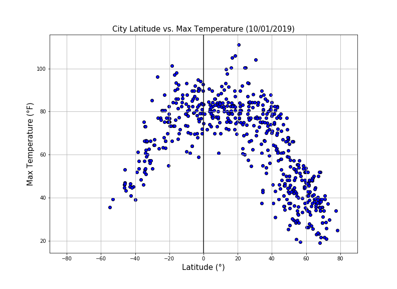
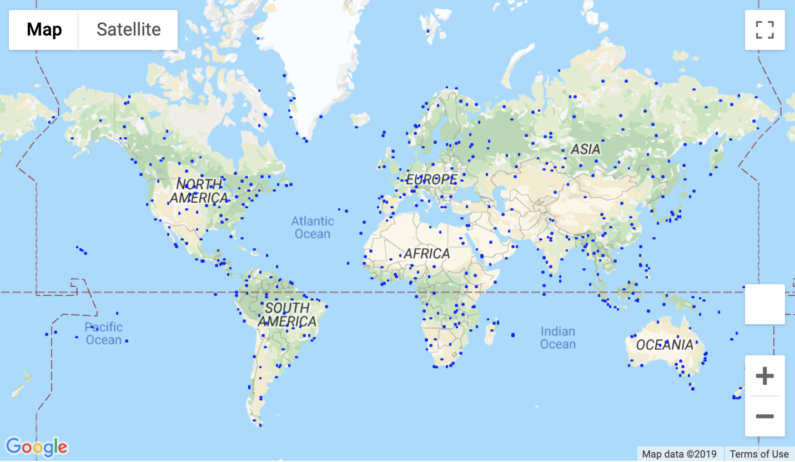

# WeatherLat

Website: https://lorsmo.github.io/weatherlat

<p align="center">
  
</p>

In the WeatherLat project, the objective is to answer this question: "What's the weather like as we approach the equator?"

The Citypy Python library was used to randomly select 500+ cities across the world of varying distance from the equator. The OpenWeather API collected weather data for these cities.

Series of scatter were build using the Matplotlib or Pandas plotting libraries to showcase relationships.

The weather data collected on October 1st, 2019 comes from 556 cities and include factors we looked at:
- Maximum Temperature
- Humidity
- Cloudiness
- Wind Speed
The dataset includes also the coordinates (latitude and longitude), the country of the city and the date and time of the weather data collection.

The visualizations created are provided in the website, as well as explanations of trends observed.
You will also find a map showing the cities in the dataset.

# Pandas

## Imports
```python
# Dependencies and Setup
import matplotlib.pyplot as plt
import pandas as pd
import numpy as np
import requests
import time
import openweathermapy.core as owm
import gmaps
import gmaps.datasets
from ipywidgets.embed import embed_minimal_html
# Incorporated citipy to determine city based on latitude and longitude
from citipy import citipy
```
## Generate Cities List
```python
# List for holding lat_lngs and cities
lat_lngs = []
cities = []

# Create a set of random lat and lng combinations
lats = np.random.uniform(low=-90.000, high=90.000, size=1500)
lngs = np.random.uniform(low=-180.000, high=180.000, size=1500)
lat_lngs = zip(lats, lngs)

# Identify nearest city for each lat, lng combination
for lat_lng in lat_lngs:
    city = citipy.nearest_city(lat_lng[0], lat_lng[1]).city_name
    
    # If the city is unique, then add it to a our cities list
    if city not in cities:
        cities.append(city)
```

## Perform API Calls
```python
# Save config information and build query url
url = "http://api.openweathermap.org/data/2.5/weather?"
units = "imperial"
query_url = f"{url}appid={api_key1}&units={units}&q="

# set up lists to hold response data
city_names = []
countries = []
dates = []
latitudes = [] 
longitudes = []
max_temperatures = []
humidities = []
cloudinesses = []
wind_speeds = []

# Set up counters for a print log of each city as it's being processed
count_city = 1
count_set = 1

# Start the print log
print("Beginning Data Retrieval")
print("--------------------------------")

# Loop through all the cities in the list "cities", make requests and parse
for city in cities:
    response = requests.get(query_url + city).json()
    
    # Formula for percentage being processed
    percent=('{:.1f}%'.format((((count_set)-1)*49 + count_city)/(len(cities))*100))  
    print(f"{percent}   Processing Record {count_city} of Set {count_set} | {city}")
    
    # Append the values for each city 
    try:
        city_names.append(response['name'])
        countries.append(response['sys']['country'])
        dates.append(response['dt'])
        latitudes.append(response['coord']['lat'])
        longitudes.append(response['coord']['lon'])
        max_temperatures.append(response["main"]["temp_max"])
        humidities.append(response["main"]["humidity"])
        cloudinesses.append(response['clouds']["all"])
        wind_speeds.append(response["wind"]["speed"])
    
    # Keep running the code if a city is not found
    except KeyError:
            print(" City not found. Skipping...")
    
    # Adjust the counter
    if count_city < 49:
        count_city +=1 
    else:
        count_city = 1
        count_set +=1
    
    # Wait a second in loop to not over exceed 60 requests per minute   
    time.sleep(1)

print("---------------------------------")
print(f"Data Retrieval Complete: {len(city_names)} cities recorded")
print("---------------------------------")
```
    Beginning Data Retrieval
    --------------------------------
    0.2%   Processing Record 1 of Set 1 | jining
    0.3%   Processing Record 2 of Set 1 | cape town
    0.5%   Processing Record 3 of Set 1 | ponta do sol
    0.6%   Processing Record 4 of Set 1 | rikitea
    0.8%   Processing Record 5 of Set 1 | pisco
    1.0%   Processing Record 6 of Set 1 | port alfred
    1.1%   Processing Record 7 of Set 1 | vaitupu
     City not found. Skipping...
    1.3%   Processing Record 8 of Set 1 | kamenz
    1.4%   Processing Record 9 of Set 1 | saint joseph
    1.6%   Processing Record 10 of Set 1 | carnarvon
    1.7%   Processing Record 11 of Set 1 | mataura

Total cities:

    ---------------------------------
    Data Retrieval Complete: 556 cities recorded
    ---------------------------------

## Convert Raw Data to DataFrame
```python
# Convert the data into a DataFrame
data_df = pd.DataFrame({
    "City": city_names, "Country": countries, "Latitude": latitudes, "Longitude": longitudes, 
    "Date - Time": dates, "Max Temp": max_temperatures, "Humidity": humidities,
    "Cloudiness": cloudinesses, "Wind Speed": wind_speeds})
```

```python
# Change the Unix, UTC format in Date to date and time format
data_df['Date - Time'] = pd.to_datetime(data_df['Date - Time'], unit='s')
```
## Plotting the Data
### Latitude vs. Max Temperature Plot
```python
# Create a scatter plot based on the Dataframe data
plt.figure(figsize=(11,8))
plt.scatter(data_df["Latitude"], data_df["Max Temp"], marker="o", facecolors="blue", edgecolors="black", alpha=1)

# Create a title, x label, and y label for our chart
plt.title(f"City Latitude vs. Max Temperature ({date_data2})", fontsize=15)
plt.xlabel("Latitude (°)", fontsize=15)
plt.ylabel("Max Temperature (°F)", fontsize=15)

# Set the upper and lower limits of x axis
plt.xlim(-90, 90)

# Add a vertical line at x = 0 and grid
plt.axvline(x=0, color = 'black', alpha=0.9)
plt.grid()

# Save and show the graph
plt.savefig(f"../WebVisualizations/Resources/assets/images/temperaturemap.png")
plt.show()
```
<p align="center">
  
</p>

The same proceedings were used for windness, cloudiness and humidity

## Map

```python
# Store latitude and longitude in locations
locations = data_df[["Latitude", "Longitude"]]
```
```python
figure_layout = {
    'width': '800px',
    'height': '500px',
    'border': '1px solid black',
    'padding': '1px',
    'margin': '0 auto 0 auto'
}
fig = gmaps.figure(layout=figure_layout, center=(30.0, 0.0), zoom_level=1.5)
```
```python
# Assign the cities layer to a variable
cities_layer = gmaps.symbol_layer(
    locations, fill_color='blue', stroke_color='blue', scale=1
)
# Add the layer to the map
fig.add_layer(cities_layer)
fig
```
<p align="center">
  
</p>

# Website

Bootstrap was used in the navbar component for the header on every page, the bootstrap table component for the data page, and the bootstrap grid for responsiveness on the comparison page.

Meaningful Fontawesome icons were used next to links in the header.

```html
<link rel="stylesheet" href="https://stackpath.bootstrapcdn.com/bootstrap/4.3.1/css/bootstrap.min.css" integrity="sha384-ggOyR0iXCbMQv3Xipma34MD+dH/1fQ784/j6cY/iJTQUOhcWr7x9JvoRxT2MZw1T" crossorigin="anonymous">
<link rel="stylesheet" href="https://use.fontawesome.com/releases/v5.7.0/css/all.css" integrity="sha384-lZN37f5QGtY3VHgisS14W3ExzMWZxybE1SJSEsQp9S+oqd12jhcu+A56Ebc1zFSJ" crossorigin="anonymous">
```

## The website consists of 8 pages total, including:

###  - A landing page containing:

An explanation of the project.
Links to each visualizations page.


### - Four visualization pages, each with:

A descriptive title and heading tag.
The plot/visualization itself for the selected comparison.
A paragraph describing the plot and its significance.


### - A "Comparisons" page that:

Contains all of the visualizations on the same page so we can easily visually compare them.

### - A "Map" page that:

Shows the cities selected.

### - A "Data" page that:

Displays a responsive, filterable table containing the data used in the visualizations.
The table is a bootstrap table component.
The data come from exporting the .csv file as HTML with Pandas.

## The website has a navigation menu that:

 - Has the name of the site on the left of the nav which allows users to return to the landing page from any page.
Contains a dropdown on the right of the navbar named "Visualizations" which provides links to each individual visualization page.
 - Provides three more links on the right: "Comparisons" which links to the comparisons page, "Map" which links to the map page and "Data" which links to the data page
 - Is responsive (using media queries). The nav background color change.

